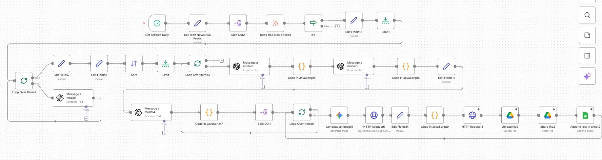
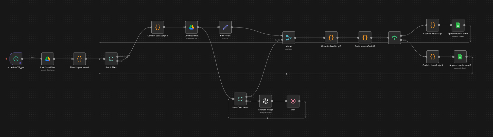
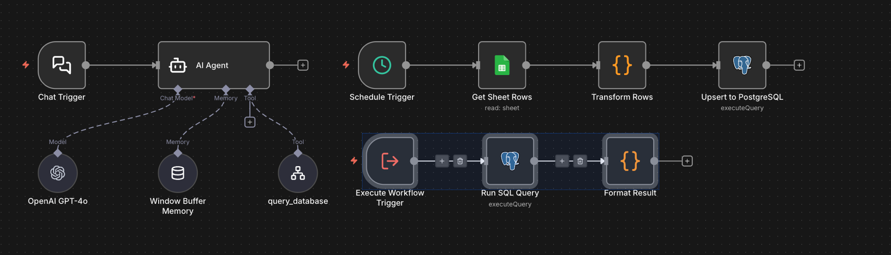
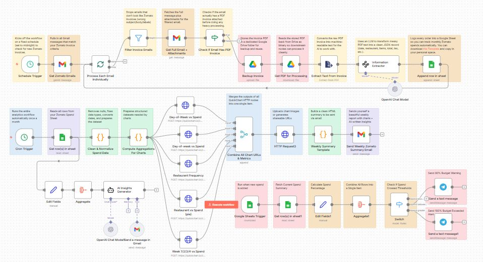
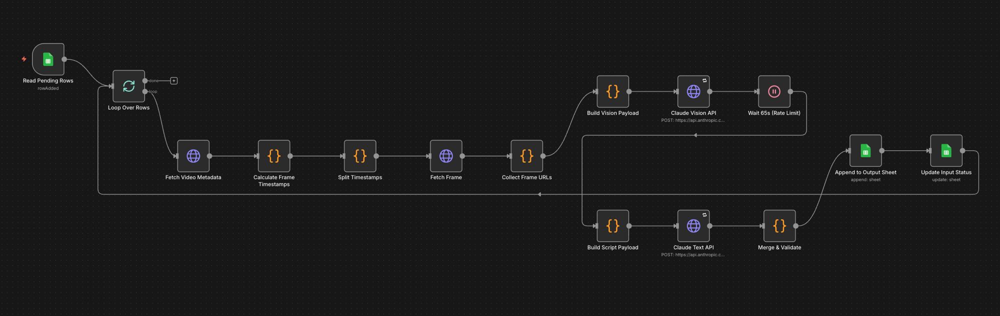

# awesome-n8n-ai-agents

> A curated collection of production-ready **n8n + LLM automation workflows** — real AI agents for job search, content creation, analytics, and more.


Each workflow in this collection is **fully documented**, **importable into n8n**, and built around a real use case — not toy examples.

---

## Workflows

### Job & Career Automation

#### [JobPilot — AI Job Search Agent](https://github.com/chintalaanvesh/jobpilot-ai-agent)
**Stack:** n8n · Claude · Next.js · Supabase

Scrapes LinkedIn jobs, scores each against your resume (0–100), generates personalized cover letters and outreach emails. Full dashboard UI with live demo.

> Demo video available in the [project repo](https://github.com/chintalaanvesh/jobpilot-ai-agent).

---

### Healthcare & Clinical AI

#### [Healthcare AI — Finding-to-Action Pipeline](https://github.com/chintalaanvesh/healthcare-ai-finding-to-action-pipeline)
**Stack:** n8n · Claude · Supabase · Twilio · SendGrid

Production-grade clinical decision routing system. Sits downstream of a medical AI model — receives a finding, runs a 4-branch signal quality gate, classifies severity with SLA timers, generates a plain-language summary in the site's local language via Claude API, and routes to WhatsApp / SMS / Email / Dashboard per per-site rules. Clinicians reply ACK / REJECT / ESCALATE. SLA breaches auto-escalate. A weekly learning loop flags high false-positive sites and asks Claude to recommend threshold adjustments for human approval.

---

### Content & Social Media Automation

#### [Instagram Content Agent](https://github.com/chintalaanvesh/instagram-content-agent)
**Stack:** n8n · GPT-4o · Gemini Imagen 4.0 · Cloudinary

RSS feeds → relevance scoring → caption + hashtag generation → AI image generation → Cloudinary post-processing → Google Sheets content calendar. Fully automated, daily.



---

### Analytics & Data Pipelines

#### [Gig Surge Analytics](https://github.com/chintalaanvesh/gig-surge-analytics)
**Stack:** n8n · GPT-4o Vision · PostgreSQL · Google Sheets

Turns delivery platform surge screenshots into a queryable PostgreSQL database. Conversational AI agent answers earnings questions in plain English using SQL tool calls.

**Image Extraction Pipeline**



**Analytics Agent + SQL Sub-workflow**



---

#### [Zomato Spend Analyzer](https://github.com/chintalaanvesh/zomato-spend-analyzer)
**Stack:** n8n · OpenAI · Telegram

Extracts Zomato invoices, analyzes spending patterns, sends reports and budget alerts via Telegram.



---

### Multimodal & Vision Pipelines

#### [Ad Variable Extraction](https://github.com/chintalaanvesh/ad-variable-extraction)
**Stack:** n8n · Claude Vision · Cloudinary · Google Sheets

Pulls video frames from Cloudinary, runs Claude Vision + Claude Text to extract 10 creative performance variables per ad, writes structured output back to Google Sheets.



---

### Chatbots & Support

#### [Credit Support Chatbot](https://github.com/chintalaanvesh/credit-support-chatbot)
**Stack:** JavaScript · HTML · LLM

AI-powered customer support chatbot for credit-related queries.

---

## How to Use Any Workflow

Every project repo contains:
- A **detailed README** with architecture diagram, workflow breakdown, and setup steps
- The **n8n workflow JSON** (importable via n8n → Import Workflow)
- Environment variable templates

**General setup pattern:**

```bash
# 1. Clone the individual project repo
git clone https://github.com/chintalaanvesh/<project-name>.git

# 2. Follow the README setup steps

# 3. Import the workflow JSON into your n8n instance
#    n8n → Workflows → Import from file → select workflow.json

# 4. Add your API credentials in n8n (OpenAI / Claude / Gemini key)

# 5. Update webhook URLs if required, then activate
```

---

## Tech Stack Across the Collection

| Category | Tools |
|----------|-------|
| Orchestration | n8n (self-hosted or cloud) |
| LLMs | Claude (Anthropic), GPT-4o (OpenAI), Gemini (Google) |
| Vision / Multimodal | Claude Vision, GPT-4o Vision, Gemini Imagen 4.0 |
| Databases | PostgreSQL, Supabase |
| Storage / Media | Cloudinary, Google Drive |
| Frontend | Next.js, TypeScript |
| Notifications | Telegram, Twilio (WhatsApp / SMS), SendGrid |
| Spreadsheets | Google Sheets |

---

## Contributing

Found a bug, want to add a workflow, or have an improvement? Contributions are welcome.

1. Fork this repo
2. Add your workflow to the relevant category above
3. Make sure your project repo has: a clear README, a workflow JSON file, and documented env variables
4. Open a PR with a short description of what your workflow does

If you want to suggest a use case for a new workflow, open an [issue](https://github.com/chintalaanvesh/awesome-n8n-ai-agents/issues) with the label `workflow-idea`.

---

## About

Built by [Chintala Anvesh](https://github.com/chintalaanvesh) — building AI agents and automation workflows with n8n, Claude, GPT-4o, and Gemini.

Connect on [LinkedIn](https://www.linkedin.com/in/chintalaanvesh) · Star this repo if it's useful ⭐
